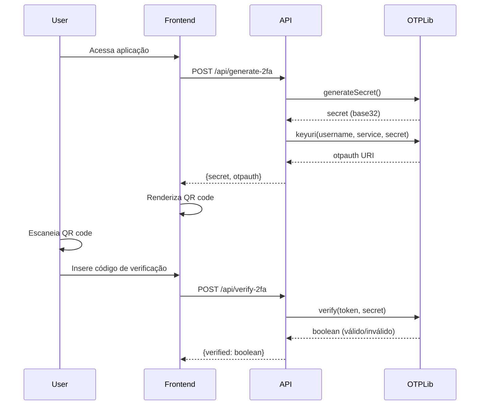
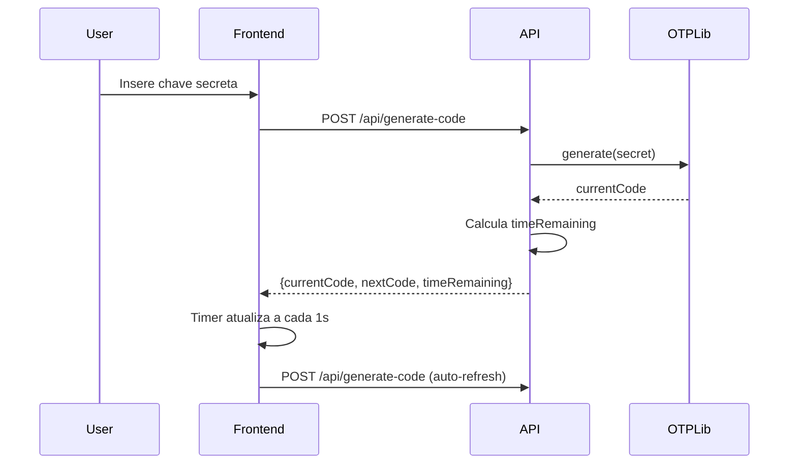
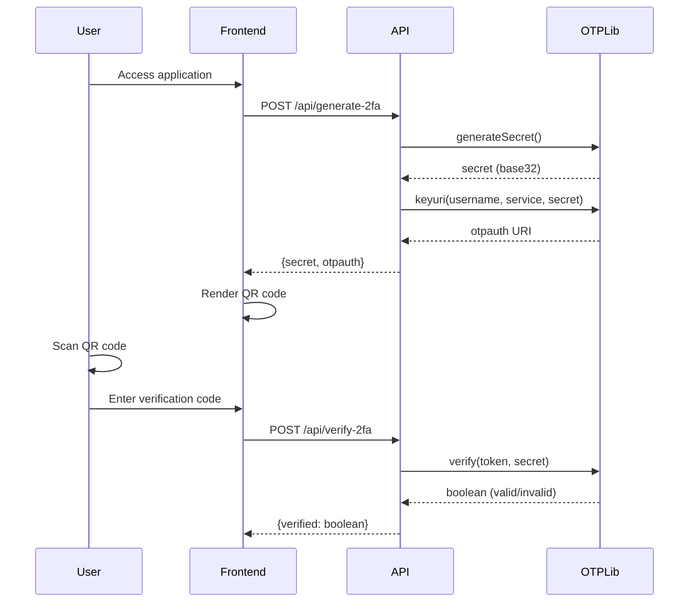

# 🔐 2FA Checker

[](#português) [](#english)

---

## Português

### 📖 Sobre o Projeto

O **2FA Checker** é uma aplicação web moderna que oferece dois modos de operação para autenticação de dois fatores (2FA):
1. **Modo Configuração**: Gera novas chaves 2FA e QR codes para configuração inicial
2. **Modo Gerador**: Funciona como um autenticador web para gerar códigos TOTP em tempo real

### 🛠️ Stack Tecnológica

| Tecnologia | Versão | Propósito |
|------------|--------|-----------|
| **Next.js** | 15.5.3 | Framework React com SSR e API Routes |
| **React** | 19.1.0 | Biblioteca para interfaces de usuário |
| **TypeScript** | ^5 | Tipagem estática e desenvolvimento seguro |
| **Tailwind CSS** | ^4 | Framework CSS utilitário para design moderno |
| **otplib** | ^12.0.1 | Biblioteca para geração e validação de OTP |
| **qrcode.react** | ^4.2.0 | Geração de QR codes SVG em React |

### 🔬 Como Funcionam os OTPs (One-Time Passwords)

#### Algoritmos Fundamentais

##### HOTP (HMAC-based One-Time Password) - RFC 4226
```
HOTP(K, C) = Truncate(HMAC-SHA1(K, C))
```

**Onde:**
- `K` = Chave secreta compartilhada (base32)
- `C` = Contador incremental (8 bytes)
- `HMAC-SHA1` = Hash-based Message Authentication Code usando SHA-1
- `Truncate` = Função que extrai um valor numérico de 4 bytes do hash

**Processo de Truncamento:**
1. Calcula HMAC-SHA1(K, C) = hash de 20 bytes
2. Extrai o offset = último nibble (4 bits) do hash
3. Extrai 4 bytes consecutivos começando no offset
4. Remove o bit mais significativo (para garantir número positivo)
5. Aplica módulo 10^d (onde d = número de dígitos desejados)

##### TOTP (Time-based One-Time Password) - RFC 6238
```
TOTP = HOTP(K, T)
T = floor((Unix_Time - T0) / X)
```

**Onde:**
- `T` = Número de intervalos de tempo desde T0
- `T0` = Tempo inicial (geralmente 0 - Unix epoch)
- `X` = Duração do intervalo (geralmente 30 segundos)
- `Unix_Time` = Timestamp atual em segundos

#### Implementação Técnica na Aplicação

##### 1. Geração da Chave Secreta
```typescript
// Usando otplib para gerar chave base32
const secret = authenticator.generateSecret();
// Resultado: String base32 (ex: "JBSWY3DPEHPK3PXP")
```

##### 2. Configuração do Algoritmo
```typescript
authenticator.options = {
  step: 30,        // Intervalo de 30 segundos
  window: 1,       // Tolerância de ±30 segundos
  digits: 6,       // Códigos de 6 dígitos
  algorithm: 'sha1', // Algoritmo de hash (padrão)
  encoding: 'base32' // Codificação da chave
};
```

##### 3. Geração do URI OTPAuth
```
otpauth://totp/SeuApp:usuario@exemplo.com?secret=JBSWY3DPEHPK3PXP&issuer=SeuApp
```

**Parâmetros do URI:**
- `totp`: Tipo de OTP (Time-based)
- `SeuApp:usuario@exemplo.com`: Label (Emissor:Conta)
- `secret`: Chave secreta em base32
- `issuer`: Nome do serviço/aplicação

##### 4. Sincronização de Tempo

A sincronização precisa de tempo é crucial para TOTP:

```typescript
// Cálculo do tempo restante até próximo código
const now = Date.now();
const step = 30 * 1000; // 30 segundos em ms
const timeRemaining = step - (now % step);
```

**Janela de Tolerância:**
- Permite códigos válidos por ±1 período (30s antes e depois)
- Compensa diferenças de relógio entre cliente e servidor
- Implementado na validação do servidor

### 🏗️ Arquitetura da Aplicação

#### Estrutura de Pastas
```
src/
├── app/                    # App Router do Next.js 13+
│   ├── globals.css        # Estilos globais com Tailwind
│   ├── layout.tsx         # Layout principal da aplicação
│   ├── page.tsx           # Página principal com ambos os modos
│   └── api/               # API Routes do Next.js
│       ├── generate-2fa/  # Endpoint para gerar nova chave 2FA
│       ├── verify-2fa/    # Endpoint para verificar códigos
│       └── generate-code/ # Endpoint para gerar códigos TOTP
```

#### Fluxo de Dados

##### Modo Configuração (Setup)


##### Modo Gerador (Generate)


#### Componentes React

##### Estados Principais
```typescript
type Mode = 'setup' | 'generate';

// Estados do modo Setup
const [qrCodeData, setQrCodeData] = useState<string | null>(null);
const [secret, setSecret] = useState<string>('');
const [verificationCode, setVerificationCode] = useState<string>('');

// Estados do modo Generate
const [inputSecret, setInputSecret] = useState<string>('');
const [codeData, setCodeData] = useState<CodeData | null>(null);
```

##### Hooks Personalizados
```typescript
// Auto-refresh para códigos TOTP
useEffect(() => {
  if (mode === 'generate' && codeData) {
    const interval = setInterval(generateCodes, 1000);
    return () => clearInterval(interval);
  }
}, [mode, codeData, generateCodes]);
```

### 🔐 Segurança e Boas Práticas

#### 1. Processamento Local
- **Chaves secretas** nunca são armazenadas no servidor
- **Geração de códigos** acontece localmente no navegador
- **Validação** usa window de tolerância limitada

#### 2. Validações Implementadas
```typescript
// Validação de formato base32
if (!/^[A-Z2-7]+=*$/i.test(secret)) {
  throw new Error('Formato de chave inválido');
}

// Validação de código de 6 dígitos
if (!/^\d{6}$/.test(cleanToken)) {
  throw new Error('Token deve conter exatamente 6 dígitos');
}
```

#### 3. Configurações de Segurança
- **Window**: Tolerância de ±1 período (30s)
- **Digits**: Códigos de 6 dígitos (10^6 = 1 milhão de combinações)
- **Step**: Renovação a cada 30 segundos
- **Algorithm**: SHA-1 (compatibilidade com apps existentes)

### � Importação do Google Authenticator

#### Como Funcionam os Códigos de Migração

Os códigos de migração do Google Authenticator utilizam uma estrutura complexa para transferir múltiplas contas TOTP de forma segura. O processo envolve **codificação base64**, **Protocol Buffers** e **estruturas de dados binárias**.

#### Estrutura da URL de Migração

```
otpauth-migration://offline?data=BASE64_ENCODED_DATA
```

**Exemplo real:**
```
otpauth-migration://offline?data=CjsKClP4LQGz02FHCBwSCnBlZHJvc3R5eHgaBkdpdEh1YiABKAEwAkITZmExYzk2MTY5MjM4NDkzNDM1MhACGAEgAA%3D%3D
```

#### Processo de Descriptografia

##### 1. Decodificação Base64 URL-Safe
```typescript
// Decodificar o parâmetro 'data' da URL
const base64Data = decodeURIComponent(urlParams.get('data'));
const binaryData = Uint8Array.from(atob(base64Data), c => c.charCodeAt(0));
```

##### 2. Estrutura Protocol Buffers

O Google utiliza **Protocol Buffers (protobuf)** para serializar os dados. A estrutura é:

```protobuf
message MigrationPayload {
  repeated OtpParameters otp_parameters = 1;
  int32 version = 2;
  int32 batch_size = 3;
  int32 batch_index = 4;
  int32 batch_id = 5;
}

message OtpParameters {
  bytes secret = 1;
  string name = 2;
  string issuer = 3;
  Algorithm algorithm = 4;
  int32 digits = 5;
  OtpType type = 6;
  int64 counter = 7;
}

enum Algorithm {
  ALGORITHM_UNSPECIFIED = 0;
  ALGORITHM_SHA1 = 1;
  ALGORITHM_SHA256 = 2;
  ALGORITHM_SHA512 = 3;
  ALGORITHM_MD5 = 4;
}

enum OtpType {
  OTP_TYPE_UNSPECIFIED = 0;
  OTP_TYPE_HOTP = 1;
  OTP_TYPE_TOTP = 2;
}
```

##### 3. Parser Protocol Buffers Customizado

Nossa implementação inclui um **parser protobuf nativo** em JavaScript:

```typescript
function decodeGoogleMigrationData(data: Uint8Array): GoogleMigrationPayload {
  const payload = { otp_parameters: [], version: 1, batch_size: 1, batch_index: 0, batch_id: 0 };
  let offset = 0;

  while (offset < data.length) {
    const key = data[offset++];
    const fieldNumber = key >> 3;  // Extrai número do campo
    const wireType = key & 0x07;   // Extrai tipo de wire

    if (fieldNumber === 1 && wireType === 2) { // otp_parameters (mensagem repetida)
      const length = data[offset++];
      const paramData = data.slice(offset, offset + length);
      offset += length;
      
      const param = decodeOtpParameter(paramData);
      payload.otp_parameters.push(param);
    }
    // ... outros campos
  }
  
  return payload;
}
```

##### 4. Conversão de Chaves Secretas

As chaves secretas no Google são armazenadas como **bytes raw** e precisam ser convertidas para **base32**:

```typescript
function base32Encode(data: Uint8Array): string {
  const alphabet = 'ABCDEFGHIJKLMNOPQRSTUVWXYZ234567';
  let bits = 0, value = 0, output = '';

  for (let i = 0; i < data.length; i++) {
    value = (value << 8) | data[i];
    bits += 8;

    while (bits >= 5) {
      output += alphabet[(value >>> (bits - 5)) & 31];
      bits -= 5;
    }
  }

  if (bits > 0) {
    output += alphabet[(value << (5 - bits)) & 31];
  }

  // Adicionar padding RFC 4648
  while (output.length % 8 !== 0) {
    output += '=';
  }

  return output;
}
```

#### Exemplo de Dados Decodificados

**Entrada (base64):**
```
CjsKClP4LQGz02FHCBwSCnBlZHJvc3R5eHgaBkdpdEh1YiABKAEwAkITZmExYzk2MTY5MjM4NDkzNDM1MhACGAEgAA==
```

**Saída (estrutura decodificada):**
```json
{
  "otp_parameters": [
    {
      "secret": [83, 248, 45, 1, 179, 211, 97, 71, 8, 28],
      "name": "pedrostyxx",
      "issuer": "GitHub",
      "algorithm": 1,    // SHA1
      "digits": 6,
      "type": 2,         // TOTP
      "counter": 0
    }
  ],
  "version": 1,
  "batch_size": 1,
  "batch_index": 0,
  "batch_id": 0
}
```

**Chave base32 resultante:**
```
KP4C2QFTXURDDAIA
```

**URI OTPAuth final:**
```
otpauth://totp/GitHub:pedrostyxx?secret=KP4C2QFTXURDDAIA&issuer=GitHub&algorithm=SHA1&digits=6&period=30
```

#### Considerações de Segurança

1. **Processamento Local**: Toda decodificação acontece no navegador
2. **Sem Armazenamento**: Dados nunca são enviados para servidores externos
3. **Descarte Imediato**: URLs são processadas e descartadas após uso
4. **Validação Rigorosa**: Verificação de integridade dos dados protobuf

#### Limitações Conhecidas

- **Algoritmos Suportados**: SHA1, SHA256, SHA512
- **Tipos Suportados**: Apenas TOTP (não HOTP)
- **Codificação**: Base32 padrão RFC 4648
- **Compatibilidade**: Google Authenticator v5.0+

### �🚀 Instalação e Uso

#### Pré-requisitos
- Node.js 18+ 
- npm ou yarn

#### Instalação
```bash
# Clone o repositório
git clone https://github.com/pedrostyxx/2fa-checker.git

# Entre no diretório
cd 2fa-checker

# Instale as dependências
npm install

# Execute em modo desenvolvimento
npm run dev
```

#### Uso

##### Modo Configuração
1. Acesse `http://localhost:3000`
2. Use o switch no topo para "Configurar 2FA"
3. Escaneie o QR code ou insira a chave manualmente
4. Digite o código gerado pelo app para verificar

##### Modo Gerador
1. Use o switch para "Gerar Códigos"
2. Cole uma chave secreta existente (base32)
3. Visualize códigos atualizando automaticamente
4. Use o countdown visual para timing

### 📊 Especificações Técnicas

#### Performance
- **Renderização**: Server-Side Rendering (SSR) com Next.js
- **Builds**: Turbopack para desenvolvimento rápido
- **Bundle**: Code splitting automático
- **Otimizações**: Lazy loading e tree shaking

#### Compatibilidade
- **Navegadores**: Todos os navegadores modernos
- **Mobile**: Interface responsiva
- **Apps 2FA**: Google Authenticator, Authy, Microsoft Authenticator
- **Padrões**: RFC 4226 (HOTP), RFC 6238 (TOTP)

#### Limitações
- **Sincronização**: Requer relógio sincronizado
- **Offline**: Funciona offline após carregamento inicial
- **Storage**: Não persiste dados (por segurança)

---

## English

### 📖 About the Project

**2FA Checker** is a modern web application that offers two operation modes for two-factor authentication (2FA):
1. **Setup Mode**: Generates new 2FA keys and QR codes for initial configuration
2. **Generator Mode**: Works as a web authenticator to generate real-time TOTP codes

### 🛠️ Tech Stack

| Technology | Version | Purpose |
|------------|---------|---------|
| **Next.js** | 15.5.3 | React framework with SSR and API Routes |
| **React** | 19.1.0 | User interface library |
| **TypeScript** | ^5 | Static typing and safe development |
| **Tailwind CSS** | ^4 | Utility-first CSS framework for modern design |
| **otplib** | ^12.0.1 | Library for OTP generation and validation |
| **qrcode.react** | ^4.2.0 | SVG QR code generation in React |

### 🔬 How OTPs (One-Time Passwords) Work

#### Fundamental Algorithms

##### HOTP (HMAC-based One-Time Password) - RFC 4226
```
HOTP(K, C) = Truncate(HMAC-SHA1(K, C))
```

**Where:**
- `K` = Shared secret key (base32)
- `C` = Incremental counter (8 bytes)
- `HMAC-SHA1` = Hash-based Message Authentication Code using SHA-1
- `Truncate` = Function that extracts a 4-byte numeric value from hash

**Truncation Process:**
1. Calculate HMAC-SHA1(K, C) = 20-byte hash
2. Extract offset = last nibble (4 bits) of hash
3. Extract 4 consecutive bytes starting at offset
4. Remove most significant bit (to ensure positive number)
5. Apply modulo 10^d (where d = desired number of digits)

##### TOTP (Time-based One-Time Password) - RFC 6238
```
TOTP = HOTP(K, T)
T = floor((Unix_Time - T0) / X)
```

**Where:**
- `T` = Number of time intervals since T0
- `T0` = Initial time (usually 0 - Unix epoch)
- `X` = Interval duration (usually 30 seconds)
- `Unix_Time` = Current timestamp in seconds

#### Technical Implementation

##### 1. Secret Key Generation
```typescript
// Using otplib to generate base32 key
const secret = authenticator.generateSecret();
// Result: Base32 string (e.g., "JBSWY3DPEHPK3PXP")
```

##### 2. Algorithm Configuration
```typescript
authenticator.options = {
  step: 30,        // 30-second interval
  window: 1,       // ±30 seconds tolerance
  digits: 6,       // 6-digit codes
  algorithm: 'sha1', // Hash algorithm (default)
  encoding: 'base32' // Key encoding
};
```

##### 3. OTPAuth URI Generation
```
otpauth://totp/YourApp:user@example.com?secret=JBSWY3DPEHPK3PXP&issuer=YourApp
```

**URI Parameters:**
- `totp`: OTP type (Time-based)
- `YourApp:user@example.com`: Label (Issuer:Account)
- `secret`: Secret key in base32
- `issuer`: Service/application name

##### 4. Time Synchronization

Precise time synchronization is crucial for TOTP:

```typescript
// Calculate remaining time until next code
const now = Date.now();
const step = 30 * 1000; // 30 seconds in ms
const timeRemaining = step - (now % step);
```

**Tolerance Window:**
- Allows valid codes for ±1 period (30s before and after)
- Compensates for clock differences between client and server
- Implemented in server validation

### 🏗️ Application Architecture

#### Folder Structure
```
src/
├── app/                    # Next.js 13+ App Router
│   ├── globals.css        # Global styles with Tailwind
│   ├── layout.tsx         # Main application layout
│   ├── page.tsx           # Main page with both modes
│   └── api/               # Next.js API Routes
│       ├── generate-2fa/  # Endpoint to generate new 2FA key
│       ├── verify-2fa/    # Endpoint to verify codes
│       └── generate-code/ # Endpoint to generate TOTP codes
```

#### Data Flow

##### Setup Mode


##### Generator Mode


#### React Components

##### Main States
```typescript
type Mode = 'setup' | 'generate';

// Setup mode states
const [qrCodeData, setQrCodeData] = useState<string | null>(null);
const [secret, setSecret] = useState<string>('');
const [verificationCode, setVerificationCode] = useState<string>('');

// Generate mode states
const [inputSecret, setInputSecret] = useState<string>('');
const [codeData, setCodeData] = useState<CodeData | null>(null);
```

##### Custom Hooks
```typescript
// Auto-refresh for TOTP codes
useEffect(() => {
  if (mode === 'generate' && codeData) {
    const interval = setInterval(generateCodes, 1000);
    return () => clearInterval(interval);
  }
}, [mode, codeData, generateCodes]);
```

### 🔐 Security and Best Practices

#### 1. Local Processing
- **Secret keys** are never stored on server
- **Code generation** happens locally in browser
- **Validation** uses limited tolerance window

#### 2. Implemented Validations
```typescript
// Base32 format validation
if (!/^[A-Z2-7]+=*$/i.test(secret)) {
  throw new Error('Invalid key format');
}

// 6-digit code validation
if (!/^\d{6}$/.test(cleanToken)) {
  throw new Error('Token must contain exactly 6 digits');
}
```

#### 3. Security Settings
- **Window**: ±1 period tolerance (30s)
- **Digits**: 6-digit codes (10^6 = 1 million combinations)
- **Step**: Renewal every 30 seconds
- **Algorithm**: SHA-1 (compatibility with existing apps)

### � Google Authenticator Import

#### How Migration Codes Work

Google Authenticator migration codes use a complex structure to securely transfer multiple TOTP accounts. The process involves **base64 encoding**, **Protocol Buffers**, and **binary data structures**.

#### Migration URL Structure

```
otpauth-migration://offline?data=BASE64_ENCODED_DATA
```

**Real example:**
```
otpauth-migration://offline?data=CjsKClP4LQGz02FHCBwSCnBlZHJvc3R5eHgaBkdpdEh1YiABKAEwAkITZmExYzk2MTY5MjM4NDkzNDM1MhACGAEgAA%3D%3D
```

#### Decryption Process

##### 1. URL-Safe Base64 Decoding
```typescript
// Decode the 'data' parameter from URL
const base64Data = decodeURIComponent(urlParams.get('data'));
const binaryData = Uint8Array.from(atob(base64Data), c => c.charCodeAt(0));
```

##### 2. Protocol Buffers Structure

Google uses **Protocol Buffers (protobuf)** to serialize data. The structure is:

```protobuf
message MigrationPayload {
  repeated OtpParameters otp_parameters = 1;
  int32 version = 2;
  int32 batch_size = 3;
  int32 batch_index = 4;
  int32 batch_id = 5;
}

message OtpParameters {
  bytes secret = 1;
  string name = 2;
  string issuer = 3;
  Algorithm algorithm = 4;
  int32 digits = 5;
  OtpType type = 6;
  int64 counter = 7;
}

enum Algorithm {
  ALGORITHM_UNSPECIFIED = 0;
  ALGORITHM_SHA1 = 1;
  ALGORITHM_SHA256 = 2;
  ALGORITHM_SHA512 = 3;
  ALGORITHM_MD5 = 4;
}

enum OtpType {
  OTP_TYPE_UNSPECIFIED = 0;
  OTP_TYPE_HOTP = 1;
  OTP_TYPE_TOTP = 2;
}
```

##### 3. Custom Protocol Buffers Parser

Our implementation includes a **native protobuf parser** in JavaScript:

```typescript
function decodeGoogleMigrationData(data: Uint8Array): GoogleMigrationPayload {
  const payload = { otp_parameters: [], version: 1, batch_size: 1, batch_index: 0, batch_id: 0 };
  let offset = 0;

  while (offset < data.length) {
    const key = data[offset++];
    const fieldNumber = key >> 3;  // Extract field number
    const wireType = key & 0x07;   // Extract wire type

    if (fieldNumber === 1 && wireType === 2) { // otp_parameters (repeated message)
      const length = data[offset++];
      const paramData = data.slice(offset, offset + length);
      offset += length;
      
      const param = decodeOtpParameter(paramData);
      payload.otp_parameters.push(param);
    }
    // ... other fields
  }
  
  return payload;
}
```

##### 4. Secret Key Conversion

Secret keys in Google are stored as **raw bytes** and need to be converted to **base32**:

```typescript
function base32Encode(data: Uint8Array): string {
  const alphabet = 'ABCDEFGHIJKLMNOPQRSTUVWXYZ234567';
  let bits = 0, value = 0, output = '';

  for (let i = 0; i < data.length; i++) {
    value = (value << 8) | data[i];
    bits += 8;

    while (bits >= 5) {
      output += alphabet[(value >>> (bits - 5)) & 31];
      bits -= 5;
    }
  }

  if (bits > 0) {
    output += alphabet[(value << (5 - bits)) & 31];
  }

  // Add RFC 4648 padding
  while (output.length % 8 !== 0) {
    output += '=';
  }

  return output;
}
```

#### Decoded Data Example

**Input (base64):**
```
CjsKClP4LQGz02FHCBwSCnBlZHJvc3R5eHgaBkdpdEh1YiABKAEwAkITZmExYzk2MTY5MjM4NDkzNDM1MhACGAEgAA==
```

**Output (decoded structure):**
```json
{
  "otp_parameters": [
    {
      "secret": [83, 248, 45, 1, 179, 211, 97, 71, 8, 28],
      "name": "pedrostyxx",
      "issuer": "GitHub",
      "algorithm": 1,    // SHA1
      "digits": 6,
      "type": 2,         // TOTP
      "counter": 0
    }
  ],
  "version": 1,
  "batch_size": 1,
  "batch_index": 0,
  "batch_id": 0
}
```

**Resulting base32 key:**
```
KP4C2QFTXURDDAIA
```

**Final OTPAuth URI:**
```
otpauth://totp/GitHub:pedrostyxx?secret=KP4C2QFTXURDDAIA&issuer=GitHub&algorithm=SHA1&digits=6&period=30
```

#### Security Considerations

1. **Local Processing**: All decoding happens in the browser
2. **No Storage**: Data is never sent to external servers
3. **Immediate Disposal**: URLs are processed and discarded after use
4. **Strict Validation**: Protobuf data integrity verification

#### Known Limitations

- **Supported Algorithms**: SHA1, SHA256, SHA512
- **Supported Types**: TOTP only (not HOTP)
- **Encoding**: Standard base32 RFC 4648
- **Compatibility**: Google Authenticator v5.0+

### �🚀 Installation and Usage

#### Prerequisites
- Node.js 18+
- npm or yarn

#### Installation
```bash
# Clone repository
git clone https://github.com/pedrostyxx/2fa-checker.git

# Enter directory
cd 2fa-checker

# Install dependencies
npm install

# Run in development mode
npm run dev
```

#### Usage

##### Setup Mode
1. Access `http://localhost:3000`
2. Use the top switch for "Setup 2FA"
3. Scan QR code or enter key manually
4. Enter code generated by app to verify

##### Generator Mode
1. Use switch for "Generate Codes"
2. Paste an existing secret key (base32)
3. View codes updating automatically
4. Use visual countdown for timing

### 📊 Technical Specifications

#### Performance
- **Rendering**: Server-Side Rendering (SSR) with Next.js
- **Builds**: Turbopack for fast development
- **Bundle**: Automatic code splitting
- **Optimizations**: Lazy loading and tree shaking

#### Compatibility
- **Browsers**: All modern browsers
- **Mobile**: Responsive interface
- **2FA Apps**: Google Authenticator, Authy, Microsoft Authenticator
- **Standards**: RFC 4226 (HOTP), RFC 6238 (TOTP)

#### Limitations
- **Synchronization**: Requires synchronized clock
- **Offline**: Works offline after initial load
- **Storage**: Doesn't persist data (for security)

---

### 📄 License

This project is licensed under the MIT License.

### 🤝 Contributing

Contributions are welcome! Please feel free to submit a Pull Request.

### 📧 Contact

**Pedro** - [@pedrostyxx](https://github.com/pedrostyxx)

Project Link: [https://github.com/pedrostyxx/2fa-checker](https://github.com/pedrostyxx/2fa-checker)
